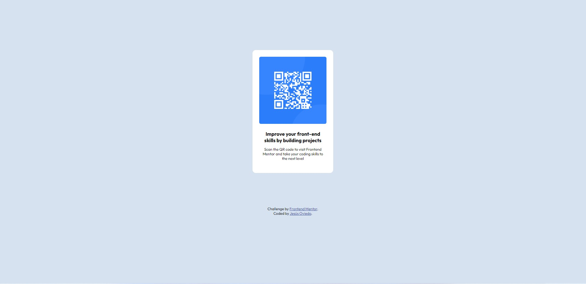

# Frontend Mentor - QR code component solution

This is a solution to the [QR code component challenge on Frontend Mentor](https://www.frontendmentor.io/challenges/qr-code-component-iux_sIO_H). Frontend Mentor challenges help you improve your coding skills by building realistic projects. 

## Table of contents

- [Screenshot](#screenshot)
- [Links](#links)
- [Built with](#built-with)
- [What I learned](#what-i-learned)
- [Continued development](#continued-development)
- [Useful resources](#useful-resources)
- [Author](#author)
- [Acknowledgments](#acknowledgments)

### Screenshot

### Links

- Solution URL: [https://github.com/jesu1090p/FrontEndMentor_QR_Code](https://github.com/jesu1090p/FrontEndMentor_QR_Code)
- Live Site URL: [https://jesu1090p.github.io/FrontEndMentor_QR_Code/](https://jesu1090p.github.io/FrontEndMentor_QR_Code/)

### Built with

- Semantic HTML5 markup
- CSS custom properties
- Flexbox

### What I learned

Struggling a bit with aligning items using flex-box but finally got as close as I could to the desktop result. 

### Continued development

I'd like to master CSS and Javascript to become a FrontEnd dev and boost my carreer on this field. In the near future I expect to start a position as a React developer.

### Useful resources

- [Aligning Items in a Flex Container](https://developer.mozilla.org/es/docs/Web/CSS/CSS_Flexible_Box_Layout/Aligning_Items_in_a_Flex_Container) - This helped me center the container and main div.

## Author

- Frontend Mentor - [@JesusOviedo](https://www.frontendmentor.io/profile/jesu1090p)
- Twitter - [@jesusmoviedo](https://www.twitter.com/jesusmoviedo)

## Acknowledgments

Thanks to the MDN team and CSS Tricks.
